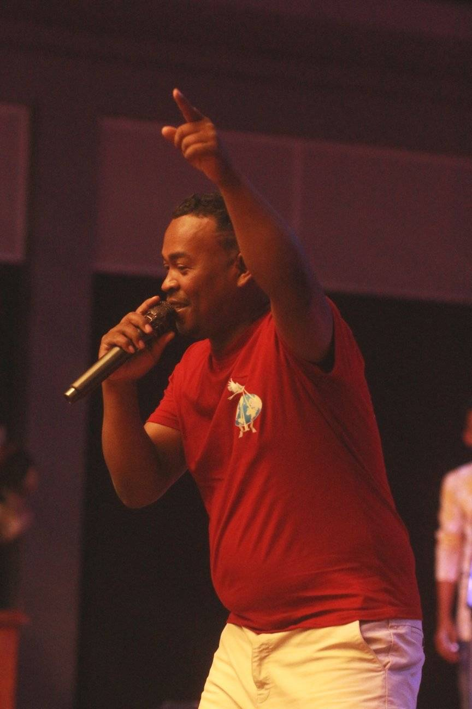

<!DOCTYPE html>
<html lang="mg">
<head>
  <meta charset="UTF-8" />
  <meta name="viewport" content="width=device-width, initial-scale=1.0"/>
  <title>Taratra Hazavana Madagasikara — Pejy Ofisialy</title>
  
</head>
<body>
  <header>
    <h1>Taratra Hazavana Madagasikara</h1>
    
<em>"Finoana tsy maintsy tafita — Faneva sy finoana mitarika fandresena"</em>

  </header>

  <main>
    <section>
      <h2>Mombamomba ny Tarika</h2>
      
Antoko mpihira evanjelika miorina ao <strong>Toamasina</strong>, Madagasikara.

      
Natsangan’i <strong>RANDRIANAIVO Lova Jean Florent</strong>, izay no <strong>Filoha mpitarika</strong> ny tarika.

      
<strong>Toerana nihaviana:</strong> avy any <em>Betafo Maromandray (Antsirabe)</em>, fa monina any <strong>Toamasina, Madagasikara</strong>.

      
<strong>Asa:</strong> Misehatra amin’ny sehatra <em>Électronique, Informatique, Hardware</em>, sy <em>Maintenance</em>.

    </section>

    <section>
      <h2>Lohatenin-kira efa vita</h2>
      <ul>
        <li>01 - TARATRA HAZAVANA — FINOANA TSY MAINTSY TAFITA (By Mazava Record)</li>
        <li>02 - TARATRA HAZAVANA — MBA TSAPANAO VE</li>
        <li>03 - TARATRA HAZAVANA — MIOMANA (Tsapiky)</li>
        <li>04 - TARATRA HAZAVANA — TSY HO LANY MAMY (Slow)</li>
        <li>05 - TARATRA HAZAVANA — NDAO HANDIHY (Beat)</li>
        <li>06 - TARATRA HAZAVANA & MAHERY AMIN’NY FIDERANA — SAMY MAHERY</li>
        <li>07 - TARATRA HAZAVANA — FIAROVANA AVO (Tsapiky)</li>
        <li>08 - TARATRA HAZAVANA & MENAFIFY M'VAZO — MANANA FINOANA</li>
        <li>09 - TARATRA HAZAVANA — AZA ILAOZANAO (Reggae)</li>
        <li>10 - TARATRA HAZAVANA — ILAY TANY NIAVIAKO (Slow - Nouveauté Gasy 2022)</li>
        <li>11 - TARATRA HAZAVANA — INTY AHO (Slow - By Mazava Record)</li>
        <li>12 - TARATRA HAZAVANA — JESO MPANAFAKA (By Mazava Record)</li>
        <li>13 - TARATRA HAZAVANA — DEDICACE</li>
        <li>14 - TARATRA HAZAVANA — HALELOIA (Official)</li>
        <li>15 - TARATRA HAZAVANA — HIDERA NY TOMPO (Soukouss Dombolo)</li>
        <li>16 - TARATRA HAZAVANA ft ONJA (Tinondia) — ROMBAROMBAO (Tsapiky)</li>
      </ul>
    </section>

    <section>
      <h2>Sary sy Sanganasa</h2>
      
      
      
      
    </section>

    <section>
      <h2>Rohy Video</h2>
      
<a href="https://www.youtube.com/watch?v=0hwNrcdpLW0" target="_blank" rel="noopener noreferrer">Hijery an'i Taratra Hazavana amin'ny YouTube</a>

    </section>
  </main>

  <footer>
    © 2025 Taratra Hazavana Madagasikara — Pejy Ofisialy
  </footer>
</body>
</html>

