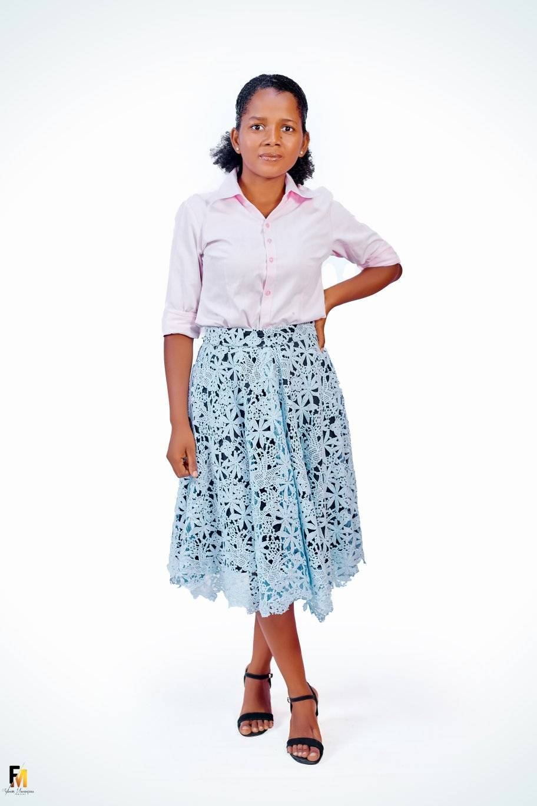
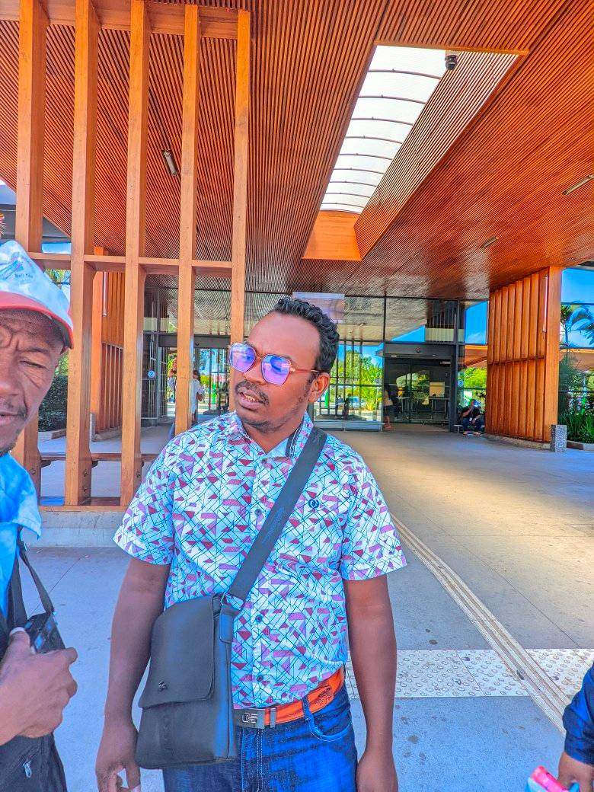
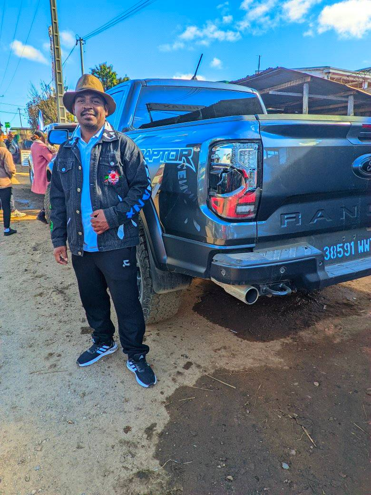

<!DOCTYPE html>
<html lang="mg">
<head>
  <meta charset="UTF-8" />
  <meta name="viewport" content="width=device-width, initial-scale=1.0"/>
  <title>Taratra Hazavana Madagasikara — Pejy Ofisialy</title>
  
</head>
<body>
  <header>
    <h1>Taratra Hazavana Madagasikara</h1>
    
<em>"Finoana tsy maintsy tafita — Faneva sy finoana mitarika fandresena"</em>

  </header>

  <main>
    <h2>Mombamomba ny Tarika</h2>
    
Antoko mpihira evanjelika miorina ao <strong>Toamasina</strong>, Madagasikara.

    
Natsangan’i <strong>Randrianaivolo Lova</strong> tamin’ny taona 2017.

    
Lohatenin-kira voalohany: <strong>"Finoana tsy maintsy tafita"</strong>.

    
    <h2>Sary sy Sanganasa</h2>
    
    
    
    

    <h2>Rohy Video</h2>
    
<a href="https://www.youtube.com/watch?v=0hwNrcdpLW0" target="_blank">Hijery an'i Taratra Hazavana amin'ny YouTube</a>

  </main>

  <footer>
    © 2025 Taratra Hazavana Madagasikara — Pejy Ofisialy
  </footer>
</body>
</html>
